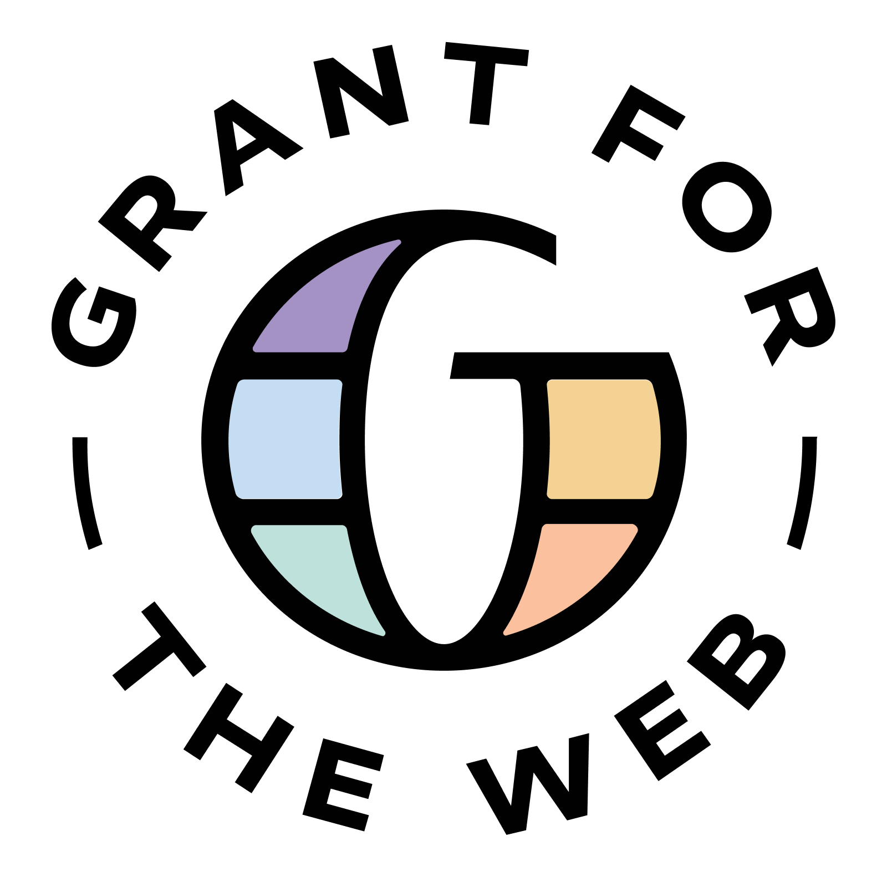
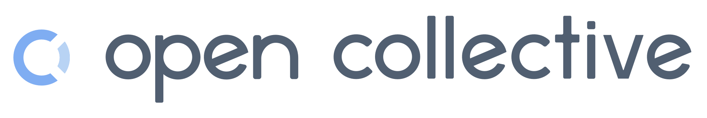
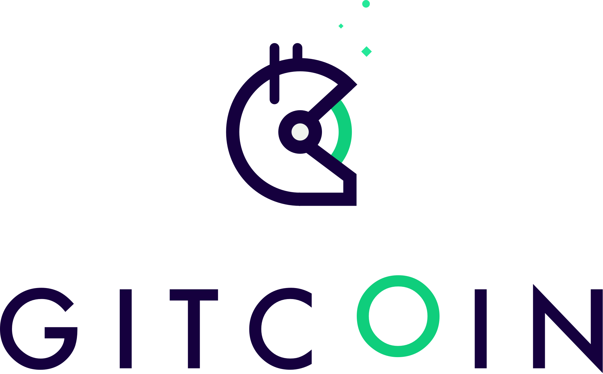

---




## -ˋˏ ༻our other projects + writings༺ ˎˊ-

### ⦑k⦒⦑o⦒⦑l⦒⦑a⦒
```
https://www.kolaheywardrotimi.com/
```

### ЄЄꌚ𝕙𝖎Ƭα
```
https://killjoycooking.network/
```

### ℂ𝕖𝕝𝕚𝕟𝕖 ✿
```
https://celinenguyen.com/
https://www.are.na/celine-nguyen/

```

### ≋A≋N≋D≋I≋
```
https://artsed4all.blog/  
```

### 𝕄𝓪𝐫Ⓖå𝚛ε𝓽
```
https://margaretwarren.us/ 
https://imagesnippets.com/
```

### b⃣ . e⃣ . n⃣ . n⃣ . y⃣ .
```
https://www.instagram.com/twicetunatuna/
https://newart.city
```

### L̳I̳ᗩᎥƶꄲꋊ
```
https://wake.st/
```

### S̊⫶ů⫶l̊⫶t̊⫶å⫶n̊⫶å⫶
```
https://sultanazana.github.io/dreams.io/
https://sultanazana.github.io/fieldness.io/
https://whattt.cargo.site/
```

### ʍǟɨ
```
https://maisutton.net/

```

## SHOUT OUTS  ＼(＾▽＾)／

Huge thank you to Sharon of Nomadic Labs for building our website so thoughtfully and beautifully.

The gifs scattered throughout this issue were made by Liaizon Wakest. Thank you for bringing a little part of Kickapoo to our magazine!

Thanks for working away behind the scenes, Elon and Yurko! We truly appreciate all your support.

Hanami, we're so lucky to have you as part of our team—you continue to blow us away with your skills.

We have so so so much gratitude for our monthly supporters on Open Collective. Thank you for believing in this project and supporting us on this journey!

I want a shout out to Andi for so much inspiration; Mai, Benedict, Udit and team for great guidance and the willingness to experiment with the metadata on the images. Benny, Kola, Luandro, Eeshita, and Wakest for all the exciting ideas and connections. — Margaret


## ＊✿❀ BIG thank you to our supporters + partners! ❀✿＊

<a href="https://hypha.coop" target="_blank"></a>
<a href="https://grantfortheweb.org" target="_blank"></a>
<a href="https://www.madebysuper.com" target="_blank"></a>
<a href="https://distributed.press" target="_blank"></a>
<a href="https://opencollective.com" target="_blank"></a>
<a href="https://webmonetization.org" target="_blank"></a>
<a href="https://gitcoin.co" target="_blank"></a>


⋇⋆✦⋆⋇ _end_ ⋇⋆✦⋆⋇

---
