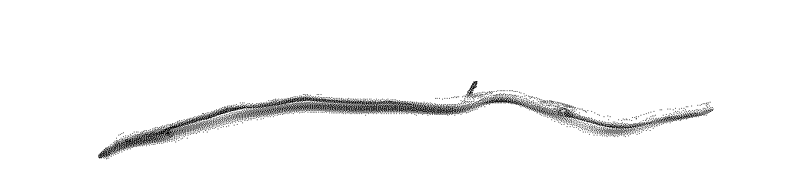



    
Walking through the woods I stop and pick up a leaf, and then another. I have a handful of leaves; each is a frame of a tiny film starring Leaf.

    

    
    
Leaves stack up next to the scanner, waiting to be made static. Beginning a life without the natural entropy of decomposition. A permanent stillness. Their digital reflection is the first step to a new movement.

    
    
Laying out a series of semi-living artifacts on the open eye of a mid-millennium scanning apparatus feels ritualistic. Protecting a memory of the moment I acknowledge their inherent importance.

    
    

        
This animation of black raspberries only has three frames because the other frames were too juicy not to eat.

        
    

    
    
The grape tendrils reach for anything they can hold onto, including the passing humans who want only to harvest them for curvature of their lines.

    
I scanned 42 milkweed flowers in one go.

    
    

        
I always scan at very large resolutions.

        
    

    
    
    

    
But as you can see, I don't use anywhere near all of that resolution in the final output.

    

I wonder why I do this. I worry I'll miss something important if I don't capture their full detail. What if there is a hidden world on every surface that I just can't see with my naked eye?

    
    

These animations were merely waiting for someone to curate their existence.

Half of the curly willow tree on the edge of the yard of my childhood home fell during a storm this month. It had died long ago but had stayed upright for many years, waiting until I was present to let go.

I watched the neighbor, annoyed as they avoided mowing a large part of their yard where this tree had fallen. Around they went on a riding mower, the sound of the machine echoing throughout all four blocks of the sleepy town. I went with a hand saw after the neighbor left and sawed the tree into many pieces. While raking up the last remnants in preparation for the neighbor's biweekly mowing ritual, I collected a large handful of especially curly sticks and brought them inside...

While working on this project it became clear that a story behind the animations would help bring out their full depth. As one of the three organizers of COMPOST magazine, Mai emailed me a number of questions to encourage a written addition to the animations I was working on. I decided to include them directly in this piece because it accentuated the collaborative tone that has been central to this project from the beginning.

    
    

        <strong> Mai Ishikawa Sutton asked: How do these walks, your collection of these artifacts, and your scanning and transforming them into animated pixels reflect a relationship between yourself, your natural surroundings, and the web where these end up?</strong>
        
I feel as if any action I take is akin to a hyperlink, one through space and time. Deciding that a stick needs to come home with me, to be carefully laid out on the scanner, is quite silly. There is no reason why one stick is better than any other, but you can't take every stick, so a choice is necessary. But in that moment of decision, I've also chosen to preserve a link back to the point in time of making this decision. Maybe the stick chose me.

        
I don't think the web that we make digitally is really all that different from the webs of nature. We are the spiders. If only we could take the time to formulate our own webs, and not succumb to the homogenization that capitalist platforms exert on our virtual formations. The web of our own making has existed this whole time, but has been quite overshadowed by the behemoths of capital.

    

<strong>Mai: I think about how intentional you are with the tools you use and the considerations you make as you decide where to put your energy online. What does it mean to intentionally connect physical places (the woods where you're taking walks, the garden of your childhood) and where you put your attention in digital space?</strong>

    
    

I strive to be intentional with my tools, including the tools of my words and my time. I have been fascinated by technology of all kinds for as long as I can remember. I spent much of my digital life residing in the ecosystem controlled by Apple. In the last five years, I've tried very hard to remove my reliance on software that's under the control of corporations.   I've found that it's so utterly intertwined and messy, it's near impossible to perceive the human labor that this technology is entirely made from.

<strong>Mai: Maybe this GIF praxis is about paying more attention? Both how we impact our physical environments (as humans impacting the ecosystems, and as people who are or are not indigenous to the land) and how we also take up space online and what it means to pay attention there too.</strong>

    

I think about why things are the way they are most moments of the day. But when it comes to understanding the reasons *I* do things, it feels much more remote. We are all just a chaotic mess of connections. Maybe there is a direct path that explains how I got here and what led me to this moment, but I don’t think anyone would feel clarity from that story. I am content with leaving that ambiguity in the air.

    
    

        
    

All .gifs lovingly collected from the Kickapoo region of Wisconsin in July of 2021, in and around the childhood home of Liaizon Wakest.


