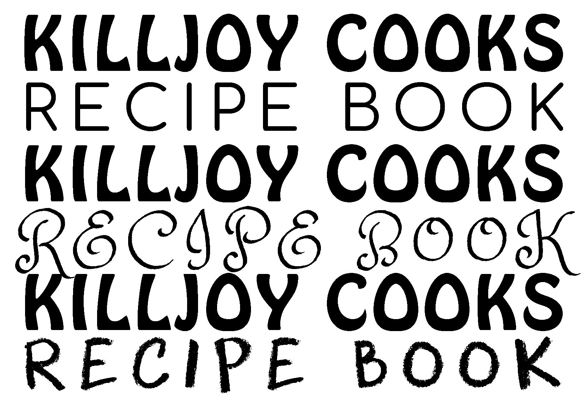

Dear Reader,

Writing in the epistolary form, or writing letters, is a tradition that calls for slowness, reflection, and intimacy. Today, writing letters can be a rare pleasure in an era of urgent responses and priority messages. Reading a letter, a handwritten one especially, can offer a glimpse into the writer's mind and perspective, one that is captured in a moment of care and consideration. Letters hold the potential to envelop us in a feeling of closeness. 

Before we begin this letter, we would like to introduce ourselves. We are Eeshita Kapadiya and Mrinalini Sebastian, writing from Bangalore and Philadelphia, respectively. We are  inviting you today to join us in a conversation about food, labour, and care. 

In January of 2020, we, Eeshita and Mrinalini, found ourselves in a new relationship, as daughter-in-law and mother-in-law. This was a beginning; an opportunity to create our own memories and narratives in a reality that normalised the belief that “women are women’s worst enemies.” Soon after, the coronavirus lockdown was announced, bringing many uncertainties and challenges with it. Gripped by a feeling of helplessness, we developed our own ways to cope with the loss and despair the pandemic had brought with it.  

Separated by the pandemic and distance, we found space to connect over our shared joy for cooking. Two women bonding over their culinary interests is hardly radical, but two women speaking across generations, identities, faith, and geography has the potential to be. Circumstance introduced a new practice between us; a channel for our ideas.

We began sharing a kitchen through a series of emails. Perhaps, through these episolatory exchanges, we were also trying to reminisce and relate; to get to know each other and to allay our intergenerational fears about our relationship. In these letters, we shared recipes that were special to us, and stories of the women who taught them to us; stories of our upbringing and the experiences that had shaped us into the women we are today. We called this exchange “Of Cooking and Conversations.” 

Cooking, for most of us, is a form of memory-laden inheritance. Our correspondence made evident that we had inherited the memories of not only our grandmothers and mothers but also of women who were not family members but domestic workers; their labour was integral to the well-being of our homes, families and selves. These letters became testament to the women who cared for us, fed us, and showed up for us in ways expected and unexpected, without whose labour we would not have the privilege of education and professional careers that we do.

Our exchanges helped us look at the kitchen as a space for play. It was not just a room that glorified women as nurturers, nor one condemned by patriarchal expectations. The conversations attempted to “engender” the kitchen in new ways: remembering the physical labour that goes into the making of a dish; transcribing our memories associated with the smell, the laughter, the communal joy of creating and eating; recognizing those whose care allowed us to be who we are today. To us, this correspondence offered a space for mutual gratitude and solidarity, for strengthening our bond, and for honoring the care we received.

As the pandemic progressed, we continued to write to each other and exchange recipes; the cooking and conversation had only just begun. We wondered: what if the letter exchange was introduced to more women? How would the idea travel? What could it unravel? Who do we write to? What are our memories of food and care? And what do we learn from each other’s “kitchen secrets”? 

In June of 2021, 16 months after our first email exchange, we asked friends and family to write letters and share recipes with women they knew or wanted to know better. The pandemic made it difficult for many of us to visit the post office, so we embraced digital technology, looking to our friend-foe, the email. Since then, more than 20 women in different parts of the world began to populate the inboxes of their friends, family, roommates, and mentors with letters and recipes.

We called this network of women and recipes the Killjoy Cooking Network. Together, we explored the joy of cooking without losing sight of the fact that the kitchen, especially in the Indian context, has often become the site of killing. The word “killjoy” came to us from Sara Ahmed’s blog, “Feminist Killjoy"  —a feminist killjoy being someone who refuses to look the other way, or just is “in the way.” As Killjoy cooks, we remember the sustenance we receive with fondness, and refuse to forget the labour: the grief and grievances of aching legs, of aching hearts, of sweaty bodies and shattered dreams. Ahmed writes: “The history of feminist critiques of happiness could be translated into a manifesto: _"Don't look over it: don't get over it.”_  What does the killjoy in the kitchen not look over then? Killjoy cooks tell stories of how far we have come and the many miles left to go. 

We recently came across the words: _“The tongue is an archive.”_  So what did it mean for us to write about our everyday lives, labour, and experiences? The Killjoy cooks’ letter exchange is an invitation to think deeply about the web of relationships we are a part of, and the wisdom we receive and impart in the process of caring and being cared for. 

Which memories stay and which ones leave? There are echoes, notions, that reverberate among us—contributing to a shared consciousness, a community. These stories have often travelled orally, hidden in cautionary tales, family secrets, or kitchen banter. What better way to help jog our memory then, than the sensory-laden act of cooking and eating?



Dear reader, this is our invitation to you. 

To tell our stories is a feminist act, perhaps even revolutionary. 

Can a recipe, the language of food, become our language of resistance, resilience, and solidarity? 

Who fed you? Who continues to feed you? And who would you like to share your story with? 

If these questions inspire you, then write a letter to someone you know; a caregiver, a friend or a mentor, in your network who represents to you a beacon of support, wisdom, and solidarity. 

Tell them your story of how you’ve been fed, nourished, and nurtured, and exchange a recipe in solidarity. 

Join us, Mrinalini and Eeshita, in writing letters with the Killjoy Cooking Network and contributing to a shared repository of recipes and our stories of food, labour and care.

<a href="https://killjoycooking.network" target="_blank">Here's how.</a>

Together, let us build a network of sustenance and solidarity.

Yours,

Eeshita Kapadiya

Mrinalini Sebastian



We would like to welcome you to the many kitchens that serve as settings for the recipes in this repository. Below is a kitchen maze, map, landscape, whichever way you’d like to see it. You’ll find recipes and conversations tucked in corners, and in kitchen paraphernalia. 

For smoother navigation and a better viewing experience, click on the last button on the top-left-hand side of the map for a fullscreen view.



You can download all the recipes shared on the kitchen map here:

If you are printing the Killjoy Cooks Recipe Book, print as an A5 size booklet for best results.



_A big thank you to the COMPOST team and all the contributors for issue 02 for their encouragement and precious insights that brought this piece together._

_A special thank you to Micah Alex, Shreyas Srivastav (Living Labs Network and Forum) and Neeraj Sebastian for the constant support along the way._

_And lastly, a shout out to all the women who exchanged recipes and letters over the last 2 months, for making the process their own, for getting uncomfortable (especially by committing to the herculean task of writing) and for breathing life into the Killjoy Cooking Network._
